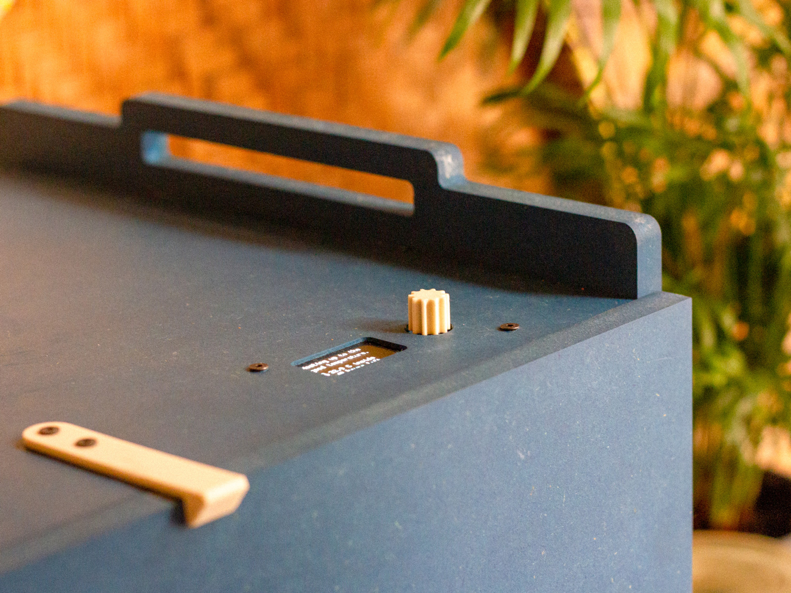
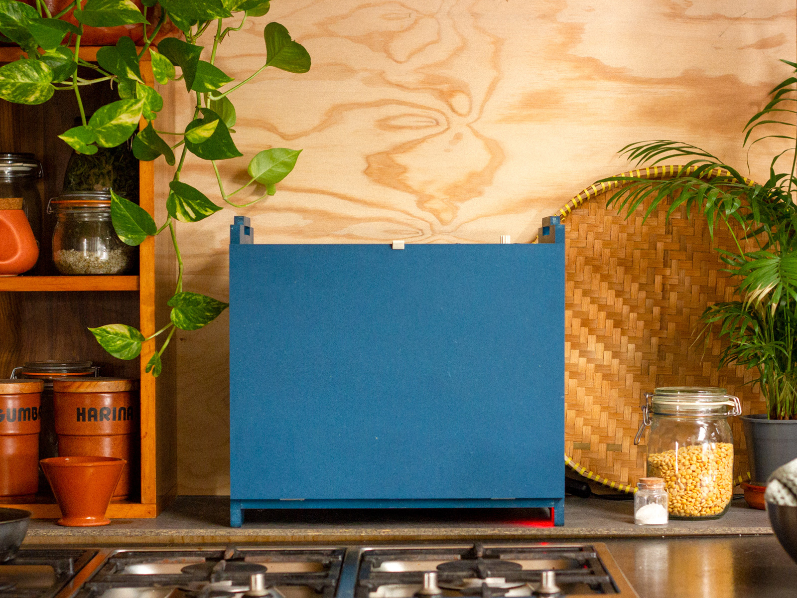
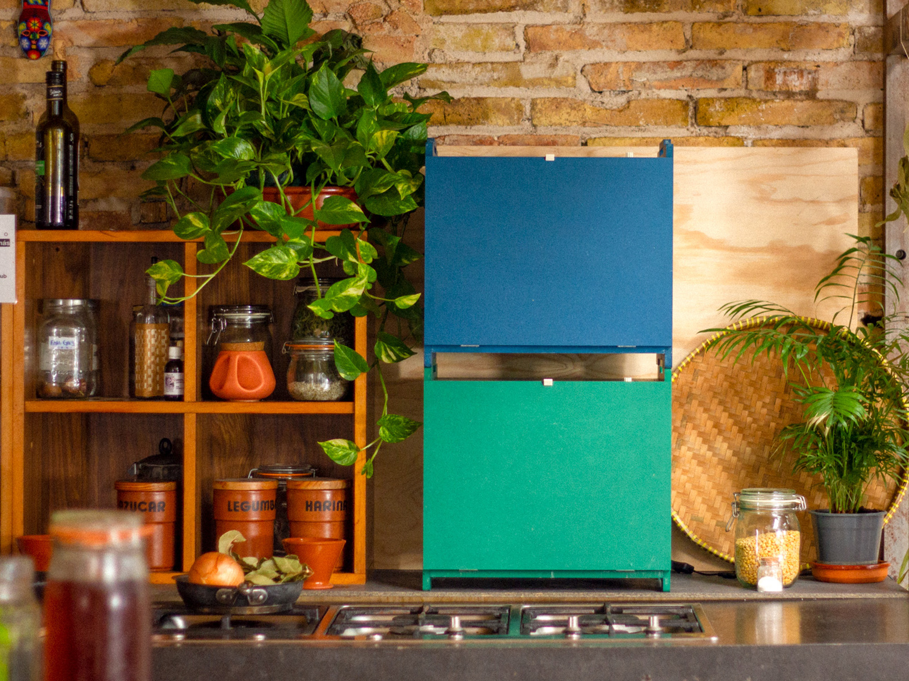

# Domingo Fermenter Lab

> An open-source fermenter that promotes fermented food and collaboration with natural processes.
 
At [Domingo Club](https://domingoclub.com/), we make fermented food, open-source tools and explore collaboration with natural processes to promote understanding, transparency, resilience and equity in our global food system.

We're developing an open-source fermenter that can be easily fabricated anywhere to promote fermented plant-based protein (tempeh) everywhere. An fermenter is a device that maintains the necessary parameters for an environment suitable for the growth of mycelium (the vegetative part of fungi) and microorganisms of all kinds.

## For kitchen scientists

Our Fermenter Lab can incubate 18 large Petri dishes at the desired temperature. It's the ideal incubator for kitchen scientists, allowing you to experiment with all kinds of fermentation processes, as well as new biomaterials and mycelium-based objects.

It features an integrated interface for choosing your fermentation/incubation mode, a heating system consisting of three heat pads and two fans to distribute the heat evenly throughout the fermenter, a digital temperature sensor, and three shelves that can be pulled out and placed on top of the fermenter to free up volume if required.

## Reaching the ideal temperature

The Fermenter Lab allows you to reach the ideal temperature for the development of your micro-organisms. For rhizopus (the fungus used for tempeh), for example, we vary the temperature from 32°C to 27°C over a period of two days, to achieve perfect development. These incubation/fermentation modes can be easily modified/created by connecting the fermenter to a computer via a usb cable, if for example you want to create a reishi mode, which swings from 29°C to 26°C over a period of 6 days.

## Make it yours

The Fermenter Lab was designed from the ground up to be easily assembled and disassembled. The fabrication plans and software of the fermenter are open-source, so you can repair it, improve it, hack into it or simply make it your own. The electronics are designed to be as standard as possible, so that they can be understood and last over time. It uses a Raspberry Pico as the brain and a customised circuit board to easily connect the various components needed for the fermenter to work properly.

## Find out more

- [Fermenter Software](https://github.com/domingoclub/fermenter-software)
- [Read the full documentation](https://domingoclub.com/projects/domingo-fermenter-lab/doc)
- [Buy it ready made](https://domingoclub.com/products/domingo-fermenter-lab)

Domingo Club → [domingoclub.com](https://domingoclub.com) & [instagram.com/domingoclub](https://instagram.com/domingoclub/)
